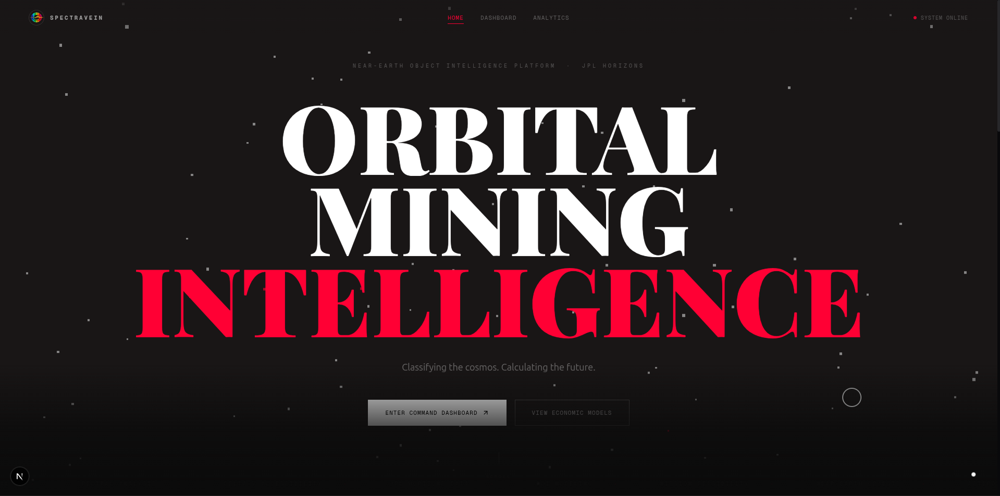
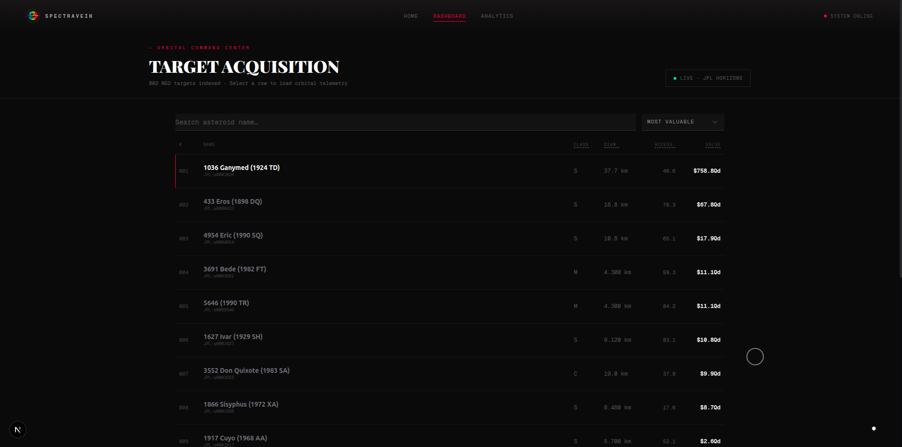
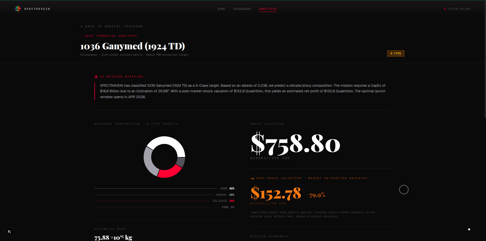

# SPECTRAVEIN · Astrava SpaceTech

> **Orbital Mining Intelligence & Economic Feasibility Engine.**  
> *Transforming raw NASA/JPL spectral data into high-yield financial targets.*

---

<!-- Drop UI screenshots here before submission -->
| Landing Page | Target Finder | Mission Analytics |
|:---:|:---:|:---:|
|  |  |  |

---

## The Vision

The asteroid belt is the solar system's commodity market — estimated at **$700 quintillion** in accessible resources — yet no institution has built the financial intelligence layer to reason about it. SPECTRAVEIN bridges that gap.

We treat each Near-Earth Object as a **financial instrument**: classifying its spectral composition via unsupervised machine learning, scoring its orbital accessibility using real delta-v physics, penalizing its gross valuation against macro-economic shock models, and stress-testing every mission against international space law. The result is a platform that speaks two languages simultaneously: **astrophysics** and **commercial aerospace economics**.

SPECTRAVEIN ingests **802 labeled Near-Earth Asteroids** from the NASA/JPL Small-Body Database and transforms them into an interactive intelligence dashboard — built during a 24-hour hackathon, production-grade in execution.

---

## System Architecture

SPECTRAVEIN is a clean separation of concerns across three tiers:

```
┌────────────────────────────────────────────────────────────────────┐
│                  FRONTEND  ·  Next.js 16 (App Router)              │
│                                                                    │
│   /              Brutalist landing page + 3D WebGL asteroid field  │
│   /dashboard     802-NEO Target Finder table + XAI tooltips        │
│   /analytics     Per-target deep financial & telemetry analysis    │
│                                                                    │
│   Design System: Pitch-black (#0a0a0a) · Griflan Red (#FF3831)     │
│   Animations:    Framer Motion v12 · Three.js WebGL Orrery         │
└────────────────────────────┬───────────────────────────────────────┘
                             │  HTTP  ·  GET /api/targets
                             │  CORS  ·  localhost:3000
┌────────────────────────────▼───────────────────────────────────────┐
│                  BACKEND  ·  FastAPI + Python                      │
│                                                                    │
│   GET /api/targets                                                 │
│     → Ingest asteroid_labeled.csv  (802 NEOs)                      │
│     → Derive: mass · gross value · market shock deflator           │
│     → Derive: CapEx · Net Profit · ESG CO₂ offset                  │
│     → Generate: XAI summary · Next pass estimate                   │
│     → Return: List[AsteroidTarget]  (Pydantic-validated JSON)      │
│                                                                    │
│   Physics Engine:  Orbital mechanics · Kepler's Third Law          │
│   ML Layer:        K-Means(k=3) spectral classification (albedo)   │
└────────────────────────────┬───────────────────────────────────────┘
                             │
┌────────────────────────────▼───────────────────────────────────────┐
│              LIVE EXTERNAL API  ·  NASA JPL CAD                    │
│                                                                    │
│   ssd-api.jpl.nasa.gov/cad.api                                     │
│     → Real-time close-approach data (2026 – 2100)                  │
│     → Next 2 passes · Absolute closest approach distance (AU)      │
│     → Used to calculate dynamic CapEx and optimal launch window    │
└────────────────────────────────────────────────────────────────────┘
```

---

## Core Innovations

### 1 · Explainable AI (XAI) — Orbital Science for Business Executives

Every hard scientific term in the UI is wrapped in an interactive **XAI Tooltip** (dotted underline, hover-to-reveal). Clicking "Inclination" doesn't just show a number — it tells you *"The vertical tilt of the asteroid's orbit relative to Earth's plane. High tilt requires exponentially more rocket fuel (Delta-v) to intercept."*

The **AI Mission Briefing** panel at the top of every analytics profile is a machine-generated executive summary, synthesising the asteroid's spectral class, accessibility score, legal status, and economic outlook into a single editorial paragraph — the kind of briefing a board of directors would actually read.

| Term | Plain-English Explanation (shown on hover) |
|---|---|
| **MOID** | Minimum Orbit Intersection Distance — closest the orbit gets to Earth |
| **Inclination** | Orbital tilt; high tilt = exponentially higher fuel cost |
| **Albedo** | Surface reflectivity; predicts composition (dark = carbon, bright = metal) |
| **Accessibility Score** | Proprietary 0–100 index combining MOID + inclination |
| **Delta-v** | Total velocity change (fuel) required to match the asteroid's trajectory |
| **AU** | Astronomical Unit — avg Earth–Sun distance (≈ 150 million km) |

---

### 2 · Advanced Economics Engine

#### Market Shock Deflator

A 37 km asteroid contains more platinum than humanity has mined in all of history. Dumping it on commodity markets wholesale would collapse global prices. SPECTRAVEIN applies a **logarithmic penalty** to every gross valuation:

```
penalty  =  0.1  +  0.9 / ( 1 + log₁₀( max(1, mass_kg / 10⁹) ) )

adjusted_value  =  gross_value  ×  penalty
```

Massive bodies (>10 km diameter) suffer **70–90% discounts**. Sub-tonne payloads are barely penalised. The output is a realistic, investable figure rather than a theoretical absurdity.

#### Dynamic CapEx Mission Costing (Delta-v Engine)

Mission cost is derived in real-time from **live NASA close-approach data**, not static estimates:

```
Base R&D / Launch:    $2,000,000,000
Distance Surcharge:   closest_pass_AU  ×  $5,000,000,000  (per AU)
Inclination Penalty:  inclination_deg  ×  $250,000,000    (per degree)
─────────────────────────────────────────────────────────
Total CapEx           = Base + Distance + Inclination
Projected Net Profit  = Adjusted Value − Total CapEx
```

A **CapEx Breakdown Modal** lets users inspect this ledger line-by-line — the same transparency expected in a real investment memorandum.

---

### 3 · Planetary Defense Lock — Legal Compliance Engine

SPECTRAVEIN enforces the **Artemis Accords** and **UN Planetary Defense Protocols** automatically. Any target meeting either condition is flagged and locked:

- The asteroid is classified as a **Potentially Hazardous Asteroid** (`PHA = Y` in the JPL database), **or**
- Its Earth close-approach distance is dangerously close (**MOID < 0.05 AU**)

When locked, the entire financial analysis is replaced with:

```
⚠ RESTRICTED TARGET: PLANETARY DEFENSE JURISDICTION
OPERATION VETOED
```

> *"Under current Artemis Accords and UN Planetary Defense protocols, commercial mining operations on Potentially Hazardous Asteroids (PHAs) or bodies with a MOID < 0.05 AU are strictly prohibited due to trajectory-alteration risks."*

Every PHA in the Target Finder table is marked with a **🔒 PHA** badge — a visual warning that the target is off-limits before the user even clicks through.

---

### 4 · ESG Terrestrial Carbon Offset Calculator

Asteroid mining is not just economically superior to terrestrial extraction — it is **ecologically necessary**. Conventional mining of rare metals produces approximately **40,000 tonnes of CO₂ per tonne** of precious metal extracted.

SPECTRAVEIN calculates the **Earth-based emissions completely bypassed** by sourcing these materials in the vacuum of space:

```
earth_co2_offset_tons  =  (mass_kg / 1000)  ×  40,000
```

This figure is displayed in the analytics panel in **Gigatons / Megatons / Kilotons** of CO₂ Prevented — making the environmental case for the mission alongside the financial case. Styled in neon emerald to stand apart from the rest of the dashboard.

---

### 5 · ISRU Propellant Pivot — The Deep-Space Gas Station

Not every asteroid is a financial payload. **Carbonaceous (C-Class) asteroids** are water-rich; their value lies not in Earth-return commodities but in **in-situ propellant production** for deep-space missions.

SPECTRAVEIN detects C-Class targets and dynamically pivots the entire financial UI:

| Condition | UI Output |
|---|---|
| M-Class or S-Class (non-PHA) | USD **Net Profit** in serif white typography |
| C-Class (non-PHA) | **ISRU Propellant Yield** in cyan — `N Billion Metric Tons of H₂/O₂ Rocket Fuel` |
| PHA / MOID < 0.05 | **OPERATION VETOED** — all financials locked |

> *"C-Class bodies are designated as strategic deep-space refueling depots — not Earth-return payload missions. A single large C-Class asteroid at a Lagrange point could supply the entire projected cislunar economy with propellant for decades."*

ISRU yield is calculated as **10% of total estimated mass** (extractable water ice), converted to metric tons of hydrogen/oxygen propellant.

---

### 6 · Live 3D Telemetry — Heliocentric Orbital Orrery

Every analytics profile features a **native WebGL 3D solar system visualization** built with `@react-three/fiber` and `@react-three/drei` — no third-party iframes.

**The mathematics:**
- Semi-minor axis: `b = a × √(1 − e²)`
- Focus offset: `c = a × e`  *(shifts the Sun to the true focal point of the ellipse)*
- Orbital speed follows **Kepler's Third Law**: `speed = 0.25 / a^1.5`
- Inclination applied via 3D group rotation: `rotation.x = i × (π / 180)`

The scene renders the **Sun** (focal origin), a **dim Earth reference ring** at 1 AU, and the **target's inclined elliptical orbit** in Griflan Red — with interactive `OrbitControls` for pan, zoom, and rotate.

**Real-time NASA CAD API** integration fetches every confirmed close approach between now and 2100:

```
ssd-api.jpl.nasa.gov/cad.api?des={id}&date-min=now&date-max=2100-01-01&dist-max=10
```

The Orbital Telemetry card displays:
- **Total Intercept Opportunities** (confirmed count, 2026–2100)
- **Next 2 Chronological Passes** with precise dates and AU distances
- **Absolute Closest Approach** — the optimal CapEx window, highlighted in red

When NASA's API is unreachable, the system degrades gracefully to a **Kepler's Third Law theoretical estimate** and displays `TELEMETRY UNAVAILABLE: OFFLINE MODE`.

---

## Sample Use Cases

### Use Case 1 · The Cash Cow (M-Class, Low Inclination)

> **Target:** `3554 Amun (1986 EB)` · M-Type · Diameter: 2.5 km · Inclination: 3.1° · Accessibility: 87/100
>
> Amun is a metallic asteroid in a nearly Earth-coplanar orbit. Its low inclination makes it extraordinarily cheap to reach — the inclination penalty adds less than $800M to mission cost. Its metallic composition (iron, nickel, platinum-group metals) yields an **Adjusted Gross Valuation** in the tens of trillions of USD after the Market Shock Deflator. After subtracting the NASA-derived dynamic CapEx, the **Projected Net Profit** display reads in multiple trillions — the canonical deep-space cash cow. Mining Viability: **PRIME TARGET**.

---

### Use Case 2 · The Gas Station (C-Class, Water-Rich)

> **Target:** `101955 Bennu (1999 RQ36)` · C-Type · Diameter: 0.49 km · Water-rich carbonaceous body
>
> Bennu's carbonaceous composition makes it commercially worthless as an Earth-return payload — but the UI **pivots automatically**. The "Projected Net Profit" column transforms into **"ISRU PROPELLANT YIELD"** in neon cyan, displaying the estimated billions of metric tons of extractable water ice convertible to hydrogen/oxygen rocket fuel. A subtitle reads: *"Strategic deep-space refueling depot. Not designated for Earth-return payload."* The ESG offset panel confirms billions of tonnes of terrestrial CO₂ emissions bypassed. This target is not a mine — it is a **filling station for the cislunar economy**.

---

### Use Case 3 · The Veto (Potentially Hazardous Asteroid)

> **Target:** `99942 Apophis (2004 MN4)` · S-Type · MOID: 0.0002 AU · PHA: Yes
>
> Despite its rich silicaceous composition and relatively modest delta-v requirements, Apophis trips two regulatory flags simultaneously: it carries a PHA designation *and* a MOID well below the 0.05 AU legal threshold. The moment this target is selected, a **crimson warning banner** dominates the Mission Profile panel. The financial analysis is completely suppressed — no gross valuation, no net profit, no CapEx breakdown. In their place: `OPERATION VETOED`. The Mining Viability indicator reads `CLASS 1 HAZARD (LEGAL LOCKOUT)` in Griflan Red. The briefing explains the relevant treaty obligations. **No investor pitch can be generated for this target.**

---

## Tech Stack

### Frontend

| Technology | Version | Role |
|---|---|---|
| **Next.js** | 16.1.6 | App Router, SSG, dynamic imports |
| **TypeScript** | 5.x | End-to-end type safety |
| **Tailwind CSS** | v4 | Utility styling, custom `@theme` tokens |
| **Framer Motion** | 12.x | Page transitions, scroll reveals, staggered animations |
| **Three.js / R3F** | 0.183 / 9.5 | Native WebGL 3D Orbital Orrery & particle field |
| **@react-three/drei** | 10.x | `OrbitControls`, `Stars` |
| **Recharts** | 2.x | Animated resource composition donut chart |
| **Shadcn UI** | — | `Dialog`, `Tooltip`, `Input`, `Select` |
| **Lenis** | — | Smooth scroll provider |
| **Lucide React** | — | Icon system |

### Backend

| Technology | Version | Role |
|---|---|---|
| **FastAPI** | 0.135.1 | High-performance async REST API |
| **Uvicorn** | 0.41.0 | ASGI production server |
| **Pandas** | 3.0.1 | CSV ingestion, null filtering, column derivation |
| **Scikit-Learn** | 1.8.0 | K-Means spectral classification |
| **Pydantic** | 2.12.5 | Strict `AsteroidTarget` response schema validation |
| **NumPy** | 2.4.2 | Vectorised physics computations |

---

## Local Deployment

### Prerequisites

- **Node.js** ≥ 18
- **Python** ≥ 3.10
- **pip** / **npm**

---

### Step 1 — Clone the Repository

```bash
git clone https://github.com/your-org/astrava-spacetech.git
cd astrava-spacetech
```

---

### Step 2 — Start the FastAPI Backend

```bash
cd backend

# Create and activate a virtual environment
python -m venv venv
source venv/bin/activate          # Windows: venv\Scripts\activate

# Install all Python dependencies
pip install -r requirements.txt

# Generate the labeled dataset (run once — takes ~10 seconds)
# This runs K-Means on raw JPL albedo data and writes asteroid_labeled.csv
python generate_labels.py

# Launch the API server with hot-reload
uvicorn main:app --reload --host 0.0.0.0 --port 8000
```

✅ Backend live at **`http://localhost:8000`**  
📄 Interactive API docs at **`http://localhost:8000/docs`**

---

### Step 3 — Start the Next.js Frontend

Open a **new terminal tab**, then:

```bash
cd frontend

# Install all Node dependencies
npm install

# Start the development server
npm run dev
```

✅ Frontend live at **`http://localhost:3000`**

---

### Step 4 — Production Build (Optional)

```bash
cd frontend
npm run build
npm start
```

---

### Architecture Note

The frontend fetches all 802 asteroid targets from `http://localhost:8000/api/targets` on page load. Ensure the FastAPI server is running **before** opening the dashboard — otherwise you will see the **"AWAITING BACKEND CONNECTION"** state. The landing page (`/`) and its 3D particle field load independently with no backend dependency.

---

## API Reference

### `GET /api/targets`

Returns all 802 labeled Near-Earth Asteroid mining targets, sorted by `adjusted_value_usd` descending.

**Sample response record:**

```json
{
  "id": "a0001036",
  "full_name": "1036 Ganymed (1924 TD)",
  "neo": true,
  "pha": false,
  "moid": 0.3449,
  "diameter_km": 37.675,
  "albedo": 0.238,
  "inclination": 26.68,
  "semi_major_axis_au": 2.665,
  "eccentricity": 0.5337,
  "spectral_class": "S",
  "classification": "S",
  "accessibility_score": 46.64,
  "estimated_mass_kg": 1.53e+17,
  "estimated_value_usd": 1.53e+18,
  "adjusted_value_usd": 2.44e+17,
  "mission_cost_usd": 2850000000,
  "net_profit_usd": 2.41e+17,
  "earth_co2_offset_tons": 6.12e+18,
  "next_pass_date": "2028",
  "xai_summary": "Ganymed is a large S-Class silicaceous body...",
  "mining_viability": "VIABLE"
}
```

---

## Project Structure

```
astrava-spacetech/
│
├── backend/
│   ├── main.py                   # FastAPI server · full physics & economics engine
│   ├── generate_labels.py        # K-Means spectral classifier (offline, run once)
│   ├── asteroid_labeled.csv      # 802 labeled NEOs (generated artifact)
│   ├── requirements.txt
│   └── .gitignore
│
└── frontend/
    ├── app/
    │   ├── page.tsx              # Landing page — 3D particle field + methodology
    │   ├── dashboard/page.tsx    # Target Finder — sortable/searchable 802-NEO table
    │   ├── analytics/page.tsx    # Mission Analytics — full financial + telemetry profile
    │   ├── template.tsx          # Framer Motion page-level transitions
    │   └── layout.tsx            # Global fonts, metadata, smooth scroll wrapper
    │
    ├── components/
    │   ├── target-finder.tsx     # Data table with XAI headers + PHA badges
    │   ├── composition-chart.tsx # Recharts animated resource donut chart
    │   ├── xai-tooltip.tsx       # Reusable hover tooltip (ReactNode trigger support)
    │   ├── loading-skeleton.tsx  # Skeleton states + ErrorBanner
    │   ├── navbar.tsx            # Fixed global navigation
    │   ├── smooth-scroll-provider.tsx  # Lenis + TooltipProvider
    │   └── ui/
    │       ├── OrbitalOrrery.tsx # Three.js WebGL heliocentric 3D visualisation
    │       ├── HeroParticles.tsx # Three.js 3000-particle interactive background
    │       ├── button.tsx        # Shadcn Button
    │       ├── dialog.tsx        # Shadcn Dialog (CapEx Breakdown Modal)
    │       ├── input.tsx         # Shadcn Input
    │       ├── select.tsx        # Shadcn Select
    │       └── tooltip.tsx       # Shadcn Tooltip (base for XaiTooltip)
    │
    └── lib/
        ├── api.ts                # fetchTargets() · apiTargetToAsteroid() · formatUSD()
        └── data.ts               # Asteroid type · getClassColors() · getClassDescription()
```

---

## Data Sources

| Source | URL | Usage |
|---|---|---|
| **NASA/JPL Small-Body Database** | [ssd.jpl.nasa.gov](https://ssd.jpl.nasa.gov/tools/sbdb_query.html) | Orbital elements, physical parameters for all 802 NEOs |
| **NASA JPL HORIZONS** | [ssd.jpl.nasa.gov/horizons](https://ssd.jpl.nasa.gov/horizons/) | High-precision ephemeris reference |
| **NASA JPL CAD API** | [ssd-api.jpl.nasa.gov/cad.api](https://ssd-api.jpl.nasa.gov/cad.api) | Real-time close-approach data (live, per-target) |
| **NASA NEO Program** | [cneos.jpl.nasa.gov](https://cneos.jpl.nasa.gov/) | PHA designations and planetary defense classifications |

---

## Legal & Disclaimer

All valuations, mission cost projections, and ROI models produced by SPECTRAVEIN are **theoretical economic simulations for research and demonstration purposes only**. They do not constitute financial, investment, legal, or mission-planning advice. The Planetary Defense Lock feature reflects the authors' interpretation of current international space law and does not constitute legal counsel.

---

<div align="center">

**SPECTRAVEIN · Astrava SpaceTech**  
*Built in 24 hours. Designed for the next century.*

</div>
